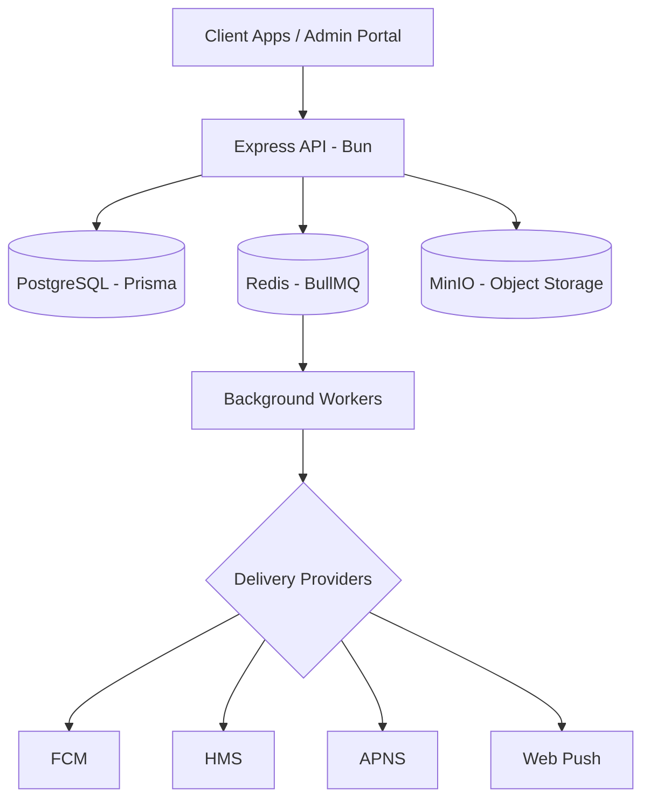

<div align="center">
  
  <h1>NotifyX</h1>
  <p><strong>A high-performance, developer-first notification engine for modern applications.</strong></p>

  [](https://bun.sh/)
  [](https://www.typescriptlang.org/)
  [](https://opensource.org/licenses/MIT)
  [](http://makeapullrequest.com)
</div>

---

## 🚀 Overview

NotifyX is a scalable notification service built to simplify complex multi-channel communication workflows. Whether you're sending transactional push notifications via FCM, HMS, or APNS, or managing marketing campaigns through a unified portal, NotifyX provides the infrastructure you need to deliver messages reliably and at scale.

## ✨ Key Features

- **Multi-Channel Delivery**: Support for FCM (Google), HMS (Huawei), APNS (Apple), and Web Push.
- **Queue-Based Processing**: High-throughput message processing powered by [BullMQ](https://docs.bullmq.io/).
- **Dynamic Campaign Management**: Create, schedule, and monitor notification campaigns via a modern dashboard.
- **Scalable Architecture**: Designed to handle millions of notifications with ease.
- **Developer First**: Clean RESTful API with automated OpenAPI documentation and type-safe clients.

## 🏗️ Architecture



## 🛠️ Project Structure

This monorepo is organized into two primary components:

- **[`/api`](file:///Users/awsqi/Documents/aws/notifyX/api)**: The core notification engine (Bun + Express + Prisma).
- **[`/portal`](file:///Users/awsqi/Documents/aws/notifyX/portal)**: The administration dashboard (React + Vite + Tailwind CSS).

---

## 🏁 Getting Started

### Prerequisites

- **[Bun](https://bun.sh/)**: The fast all-in-one JavaScript runtime.
- **[Docker](https://www.docker.com/)**: For running infrastructure services.

### 1. Infrastructure Setup

NotifyX requires PostgreSQL, Redis, and MinIO. Launch them using Docker Compose:

```bash
docker-compose up -d
```

### 2. Backend API Setup

```bash
cd api
cp .env.example .env  # Configure your credentials
bun install
bun run db:migrate    # Run migrations
bun run dev           # Start the engine
```

> **API Docs**: Access the interactive Swagger reference at `http://localhost:3000/docs`.

### 3. Frontend Portal Setup

```bash
cd portal
cp .env.example .env  # Point VITE_API_URL to the API
bun install
bun run dev           # Open the dashboard
```

---

## 💻 Tech Stack

- **Runtime**: [Bun](https://bun.sh/)
- **ORM**: [Prisma](https://www.prisma.io/)
- **Messaging**: [BullMQ](https://bullmq.io/) & [IORedis](https://github.com/luin/ioredis)
- **Frontend**: [React 19](https://react.dev/), [Vite](https://vitejs.dev/), [Tailwind CSS 4](https://tailwindcss.com/)
- **UI Components**: [Radix UI](https://www.radix-ui.com/) & [Lucide Icons](https://lucide.dev/)

## 🤝 Contributing

We welcome contributions! Please check out our [contribution guidelines](CONTRIBUTING.md) (coming soon) and feel free to open issues or pull requests.

## 🛡️ Security

If you discover a security vulnerability, please send an e-mail to security@notifyx.dev instead of using the public issue tracker.

## 📄 License

This project is licensed under the **MIT License**. See the [LICENSE](LICENSE) file for details.

---

<p align="center">Built with ❤️ by the NotifyX Team</p>
